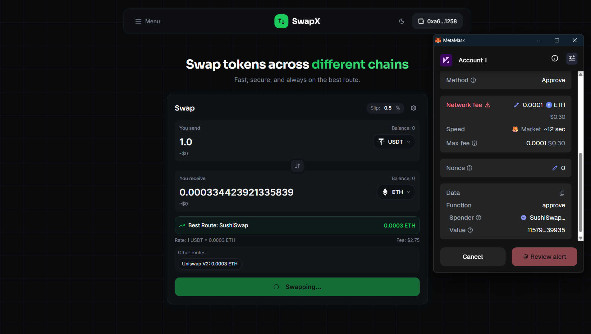

# SwapX 🔄

> **Swap tokens across different chains** - Fast, secure, and always on the best route.

A modern, decentralized exchange (DEX) aggregator built with React that aggregates liquidity from multiple DEX protocols to find you the best swap rates.


## ✨ Features

- 🔗 **Multi-DEX Support** - Uniswap V3, Uniswap V2, SushiSwap, and 1inch
- 💰 **Best Rate Finder** - Automatically compares rates across all DEXs
- 🎯 **Route Selection** - Choose the optimal swap route manually
- 🛡️ **Fallback Protection** - Automatic fallback if primary route fails
- ⚡ **Real-time Quotes** - Live rate updates as you type
- 🎨 **Modern UI** - Beautiful, responsive interface with dark mode
- 🔐 **MetaMask Integration** - Seamless wallet connection

## 🚀 Quick Start

```bash
# Clone the repository
git clone https://github.com/theyashdhiman04/SwapX.git
cd SwapX

# Install dependencies
npm install

# Start development server
npm run dev
```

Visit `http://localhost:8080` to see SwapX in action!

## 🛠️ Tech Stack

- **Frontend**: React 18 + TypeScript + Vite
- **Web3**: Ethers.js v6
- **DEX SDKs**: Uniswap V3/V2 SDK, SushiSwap
- **UI**: Tailwind CSS + Framer Motion + shadcn/ui

## 📋 Supported Networks

- ✅ Ethereum Mainnet
- ✅ Goerli Testnet
- ✅ Sepolia Testnet

## 💎 Supported Tokens

**Mainnet**: ETH, WETH, USDC, USDT, DAI, WBTC  
**Testnets**: ETH, WETH, USDC

## 📸 Screenshots




## 🔒 Security

- Always verify token addresses before swapping
- Use testnets for testing
- Review slippage settings before executing swaps
- Never share your private keys or seed phrases

## 📝 License

This project is open source and available under the [MIT License](./LICENSE).

## 👨‍💻 Author

**Yash Dhiman**

- GitHub: [@theyashdhiman04](https://github.com/theyashdhiman04)
- Twitter: [@theyashdhiman](https://x.com/theyashdhiman)
- LinkedIn: [itsyashdhiman](https://www.linkedin.com/in/itsyashdhiman/)

## 🤝 Contributing

Contributions are welcome! Please feel free to submit a Pull Request.

---

